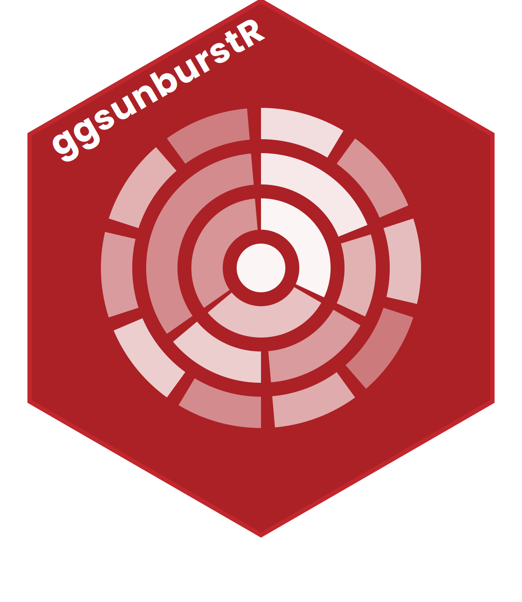

# ggsunburstR <a href="https://anttirask.github.io/ggsunburstR/"></a>

<!-- badges: start -->
[](https://github.com/AnttiRask/ggsunburstR/actions/workflows/R-CMD-check.yaml)
<!-- badges: end -->

Create sunburst, icicle, donut, and tree adjacency diagrams using
ggplot2. Accepts hierarchical data in multiple formats, computes
rectangle coordinates for each node, and produces standard ggplot2
objects that you can customise with the familiar `+` syntax.

A pure-R reimplementation of
[ggsunburst](https://github.com/didacs/ggsunburst) that eliminates the
Python/reticulate dependency.

## Installation

Install the development version from GitHub:

```r
# install.packages("pak")
pak::pak("AnttiRask/ggsunburstR")
```

## Quick start

```r
library(ggsunburstR)

# From a Newick string
sb <- sunburst_data("((a, b, c), (d, e, f));")

# Sunburst (polar) plot
sunburst(sb, fill = "depth")

# Icicle (rectangular) plot
icicle(sb, fill = "depth")

# Donut (ring) chart
donut(sb, fill = "name")

# Tree (dendrogram)
ggtree(sb)
```

## Input formats

ggsunburstR accepts seven input formats:

```r
# 1. Newick string
sb <- sunburst_data("((a, b, c), (d, e, f));")

# 2. Newick file
sb <- sunburst_data("path/to/tree.nw")

# 3. Data frame with parent-child columns
df <- data.frame(
  parent = c(NA, "root", "root", "A", "A"),
  child  = c("root", "A", "B", "a1", "a2")
)
sb <- sunburst_data(df)

# 4. Path-delimited strings
sb <- sunburst_data(c("A/B/C", "A/B/D", "A/E"))

# 5. Data frame with path column
sb <- sunburst_data(data.frame(path = c("A/B/C", "A/B/D")))

# 6. ape::phylo object
phylo <- ape::read.tree(text = "(A, B, C);")
sb <- sunburst_data(phylo)

# 7. data.tree::Node object
root <- data.tree::Node$new("root")
root$AddChild("A")
root$AddChild("B")
sb <- sunburst_data(root)
```

## Value-weighted sectors

Use the `values` parameter to size sectors by data:

```r
sb <- sunburst_data(
  "((a, b, c), (d, e, f));",
  values = c(a = 10, b = 5, c = 3, d = 8, e = 2, f = 1)
)
sunburst(sb, fill = "name")
```

## Drilldown into subtrees

Zoom into a specific branch:

```r
sb <- sunburst_data("((a, b)X, (c, d)Y)root;")
sub <- drilldown(sb, node = "X")
sunburst(sub, fill = "name")
```

## Annotations

Add bar charts or heatmap tiles adjacent to leaf nodes:

```r
df <- data.frame(
  parent = c(NA, "root", "root"),
  child  = c("root", "A", "B"),
  score  = c(NA, 0.5, 0.9),
  group  = c(NA, "x", "y")
)
sb <- sunburst_data(df)
p <- icicle(sb, fill = "depth")

# Bar annotations
bars(p, sb, variables = "score")

# Tile (heatmap) annotations
tile(p, sb, variables = "group")
```

## Label options

Control label appearance in sunburst and icicle plots:

```r
sb <- sunburst_data("((a, b, c), (d, e));")

# Arc-following (perpendicular) labels
sunburst(sb, fill = "depth", show_labels = TRUE,
         label_type = "perpendicular")

# Internal node labels + minimum angle filter
sunburst(sb, fill = "depth", show_labels = TRUE,
         show_node_labels = TRUE, min_label_angle = 30)

# ggrepel collision avoidance (icicle only)
icicle(sb, fill = "depth", show_labels = TRUE, label_repel = TRUE)
```

## Per-depth fill scales

Use different colour scales for different hierarchy levels:

```r
sb <- sunburst_data("((a, b)X, (c, d)Y)root;")

# Different fill column per depth (requires ggnewscale)
sunburst_multifill(sb, fills = list("1" = "name", "2" = "name"))
icicle_multifill(sb, fills = list("1" = "name", "2" = "name"))
```

## Highlight specific nodes

```r
sb <- sunburst_data("((a, b, c), (d, e));")
p <- sunburst(sb, fill = "depth")
highlight_nodes(p, nodes = c("a", "c"), fill = "red")
```

## Customisation

The output is a standard ggplot2 object:

```r
sb <- sunburst_data("((a, b, c), (d, e, f));")

sunburst(sb, fill = "name") +
  ggplot2::scale_fill_brewer(palette = "Set3") +
  ggplot2::labs(title = "My Sunburst")
```

## License

MIT
