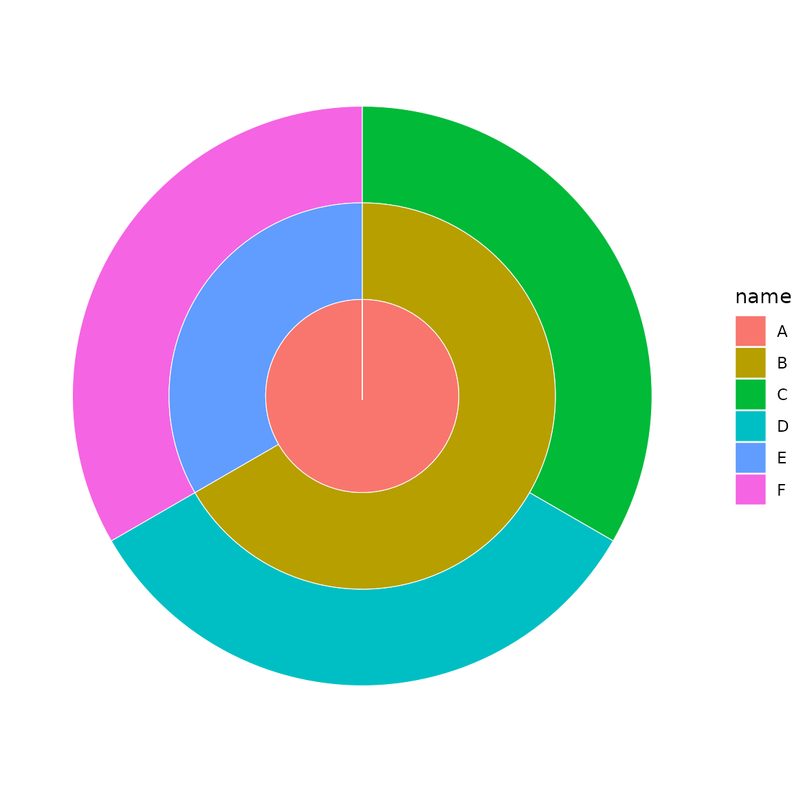
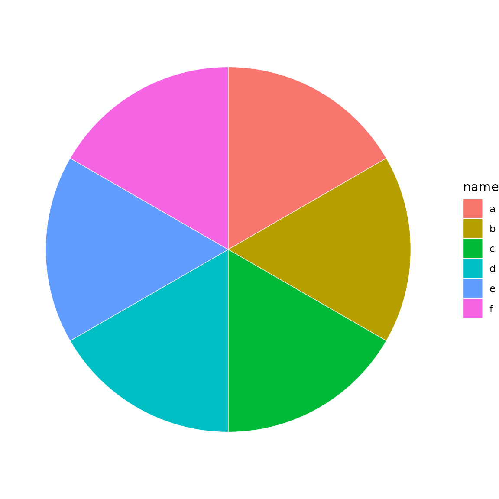
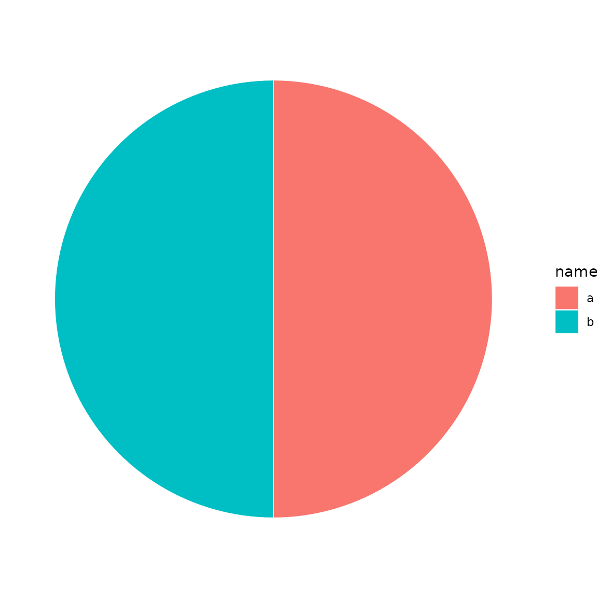
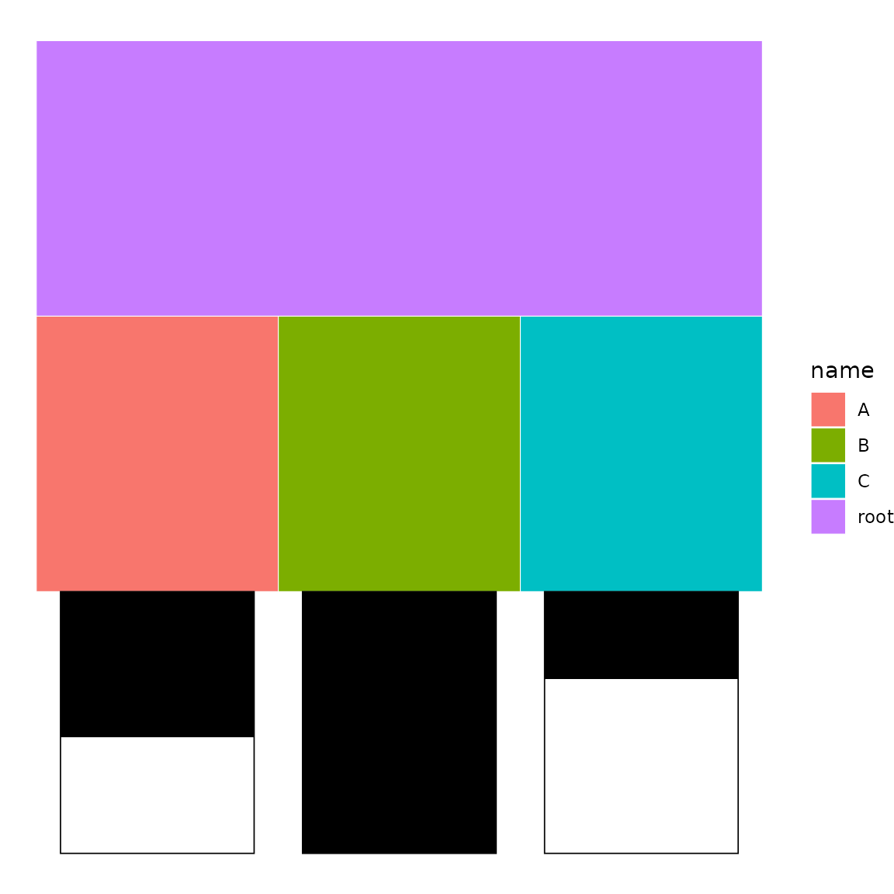
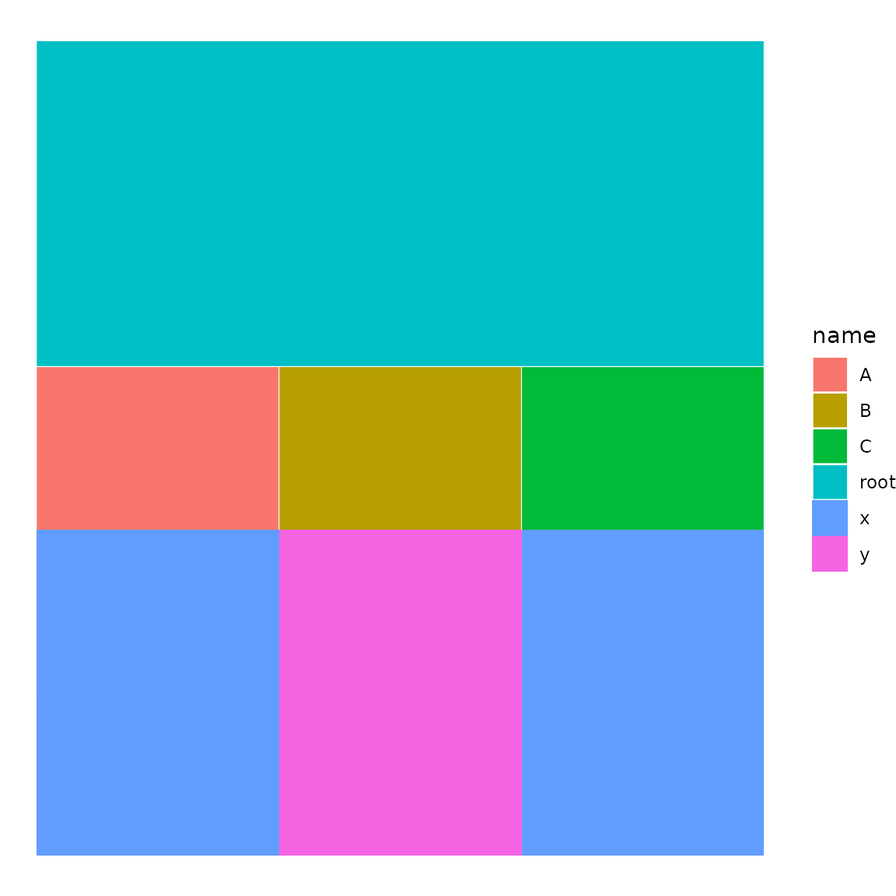
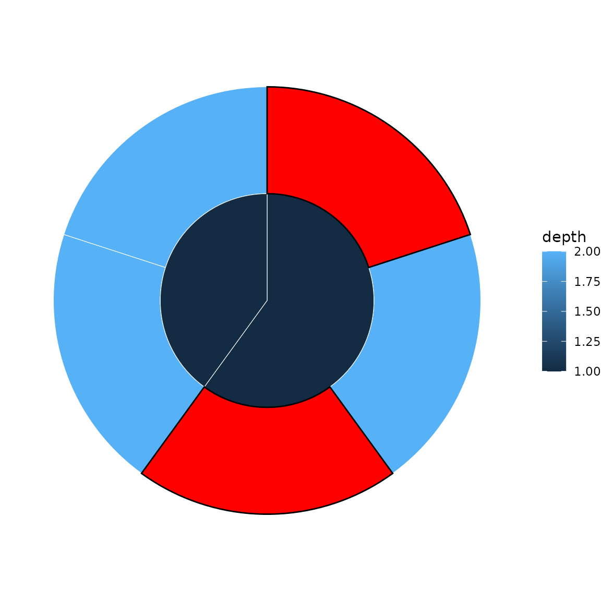
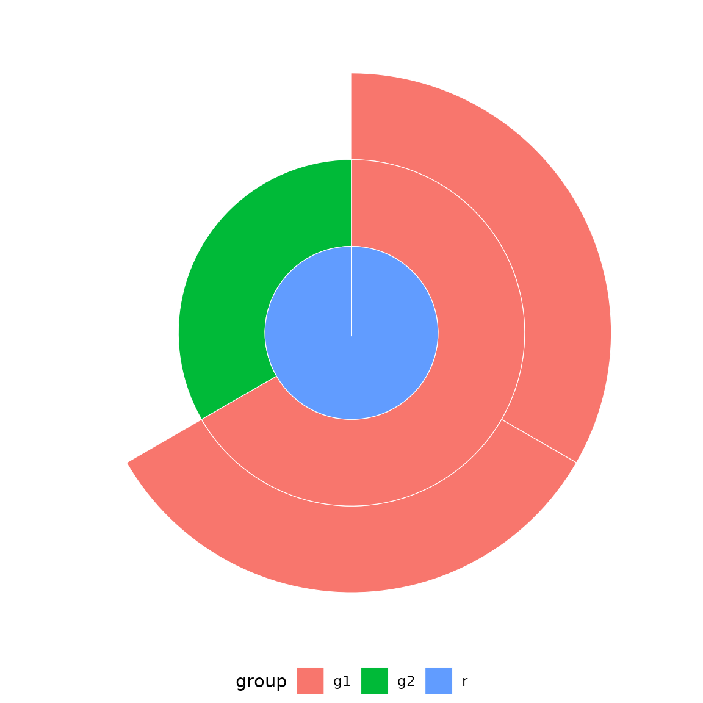

# Getting started with ggsunburstR

## Overview

ggsunburstR creates sunburst and icicle plots from hierarchical data
using ggplot2. It accepts multiple input formats and produces standard
ggplot2 objects you can customise freely.

## Basic usage

The workflow has two steps:

1.  **Prepare data** with
    [`sunburst_data()`](https://anttirask.github.io/ggsunburstR/reference/sunburst_data.md)
2.  **Plot** with
    [`sunburst()`](https://anttirask.github.io/ggsunburstR/reference/sunburst.md),
    [`icicle()`](https://anttirask.github.io/ggsunburstR/reference/icicle.md),
    [`donut()`](https://anttirask.github.io/ggsunburstR/reference/donut.md),
    or
    [`ggtree()`](https://anttirask.github.io/ggsunburstR/reference/ggtree.md)

``` r
library(ggsunburstR)

# Parse a Newick tree string
sb <- sunburst_data("((a, b, c), (d, e, f));")

# Sunburst plot
sunburst(sb, fill = "depth")
```


``` r
# Same data as an icicle plot
icicle(sb, fill = "depth")
```


## Input formats

### Newick strings

The most common input for phylogenetic or hierarchical trees:

``` r
sb <- sunburst_data("((mammals, birds, reptiles)vertebrates, (beetles, flies)insects)animals;")
sunburst(sb, fill = "name")
```


### Data frames

Use a data frame with `parent` and `child` columns:

``` r
df <- data.frame(
  parent = c(NA, "root", "root", "fruits", "fruits", "vegs", "vegs"),
  child  = c("root", "fruits", "vegs", "apple", "banana", "carrot", "pea")
)
sb <- sunburst_data(df)
sunburst(sb, fill = "name")
```


### Path-delimited strings

Hierarchies can also be expressed as slash-delimited paths:

``` r
sb <- sunburst_data(c("A/B/C", "A/B/D", "A/E/F"))
sunburst(sb, fill = "name")
```



### Other formats

ggsunburstR also accepts Newick files, node-parent CSVs, lineage TSVs,
[`ape::phylo`](https://rdrr.io/pkg/ape/man/read.tree.html) objects, and
[`data.tree::Node`](https://rdrr.io/pkg/data.tree/man/Node.html)
objects. See
[`?sunburst_data`](https://anttirask.github.io/ggsunburstR/reference/sunburst_data.md)
for details.

## Plot types

### Donut charts

A donut is a sunburst restricted to the outermost depth levels:

``` r
sb <- sunburst_data("((a, b, c), (d, e, f));")
donut(sb, fill = "name", levels = 1, hole_size = 2)
```



### Tree dendrograms

[`ggtree()`](https://anttirask.github.io/ggsunburstR/reference/ggtree.md)
renders the tree as a dendrogram:

``` r
sb <- sunburst_data("((a:0.3, b:0.5)X:0.2, (c:0.4, d:0.1)Y:0.3)root;")
ggtree(sb, show_labels = TRUE)
```


## Value-weighted sectors

By default, all leaves get equal angular width. Use `values` to size
sectors proportionally:

``` r
sb <- sunburst_data(
  "((a, b, c), (d, e));",
  values = c(a = 10, b = 5, c = 3, d = 8, e = 2)
)
sunburst(sb, fill = "name")
```


## Fill mapping

The `fill` parameter accepts column names (quoted or bare), plus the
special values `"auto"` (maps to depth) and `"none"` (static grey):

``` r
sb <- sunburst_data("((a, b, c), (d, e, f));")

# Bare name (tidy eval)
sunburst(sb, fill = depth)
```


``` r
# Auto-map to depth
sunburst(sb, fill = "auto")
```


## Labels

### Basic labels

Add leaf labels with `show_labels = TRUE`:

``` r
sb <- sunburst_data("((a, b, c), (d, e, f));")
sunburst(sb, fill = "depth", show_labels = TRUE)
```


### Perpendicular labels

Use `label_type = "perpendicular"` for arc-following labels:

``` r
sunburst(sb, fill = "depth", show_labels = TRUE,
         label_type = "perpendicular")
```


### Internal node labels and filtering

Show labels for internal nodes and filter out labels on narrow sectors:

``` r
sb <- sunburst_data("((mammals, birds, reptiles)vertebrates, (beetles, flies)insects)animals;")
sunburst(sb, fill = "name", show_labels = TRUE,
         show_node_labels = TRUE, min_label_angle = 30,
         label_size = 3.5)
```


### Label repulsion (icicle)

Use `ggrepel` for collision avoidance in icicle plots:

``` r
sb <- sunburst_data("((a, b, c, d, e), (f, g, h));")
icicle(sb, fill = "depth", show_labels = TRUE, label_repel = TRUE)
```


## Drilldown into subtrees

Zoom into a specific branch with
[`drilldown()`](https://anttirask.github.io/ggsunburstR/reference/drilldown.md):

``` r
sb <- sunburst_data("((a, b)X, (c, d)Y)root;")
sub <- drilldown(sb, node = "X")
sunburst(sub, fill = "name")
```



## Annotations

### Bar chart annotations

Add bar charts adjacent to leaf nodes:

``` r
df <- data.frame(
  parent = c(NA, "root", "root", "root"),
  child  = c("root", "A", "B", "C"),
  score  = c(NA, 0.5, 0.9, 0.3)
)
sb <- sunburst_data(df)
p <- icicle(sb, fill = "name")
bars(p, sb, variables = "score")
```



### Tile (heatmap) annotations

Add colour-coded tiles adjacent to leaf nodes:

``` r
df <- data.frame(
  parent = c(NA, "root", "root", "root"),
  child  = c("root", "A", "B", "C"),
  group  = c(NA, "x", "y", "x")
)
sb <- sunburst_data(df)
p <- icicle(sb, fill = "name")
tile(p, sb, variables = "group")
```



## Highlight specific nodes

Emphasise nodes by name or ID:

``` r
sb <- sunburst_data("((a, b, c), (d, e));")
p <- sunburst(sb, fill = "depth")
highlight_nodes(p, nodes = c("a", "c"), fill = "red")
```



## Per-depth fill scales

Use
[`sunburst_multifill()`](https://anttirask.github.io/ggsunburstR/reference/sunburst_multifill.md)
or
[`icicle_multifill()`](https://anttirask.github.io/ggsunburstR/reference/icicle_multifill.md)
to map different colour scales to different hierarchy levels:

``` r
sb <- sunburst_data("((a, b)X, (c, d)Y)root;")
sunburst_multifill(sb, fills = list("1" = "name", "2" = "name"))
```


## ggplot2 geom

For idiomatic ggplot2 syntax, use
[`geom_sunburst()`](https://anttirask.github.io/ggsunburstR/reference/geom_sunburst.md)
directly with a data.frame:

``` r
df <- data.frame(
  parent = c(NA, "root", "root", "A", "A"),
  child  = c("root", "A", "B", "a1", "a2"),
  group  = c("r", "g1", "g2", "g1", "g1")
)

ggplot2::ggplot(df) +
  geom_sunburst(ggplot2::aes(id = child, parent = parent, fill = group)) +
  ggplot2::coord_polar() +
  theme_sunburst()
```



## Tree inspection

Use
[`nw_print()`](https://anttirask.github.io/ggsunburstR/reference/nw_print.md)
to inspect tree structure:

``` r
nw_print("((a, b)X, (c, d)Y)root;")
#> 
#> Phylogenetic tree with 4 tips and 3 internal nodes.
#> 
#> Tip labels:
#>   a, b, c, d
#> Node labels:
#>   root, X, Y
#> 
#> Rooted; no branch length.
```

## Customisation with ggplot2

Since the output is a standard ggplot2 object, you can add any ggplot2
layer or theme:

``` r
sb <- sunburst_data("((a, b, c), (d, e, f));")
sunburst(sb, fill = "name") +
  ggplot2::scale_fill_brewer(palette = "Set2") +
  ggplot2::labs(title = "Custom sunburst") +
  theme_sunburst()
```


## Options

Key parameters for
[`sunburst_data()`](https://anttirask.github.io/ggsunburstR/reference/sunburst_data.md):

- `values` — named numeric vector or column name for sector sizing
- `branchvalues` — `"remainder"` (default) or `"total"`
- `leaf_mode` — `"actual"` (default) or `"extended"`
- `ladderize` — sort by descendant count
- `ultrametric` — equalise leaf depths
- `xlim` — angular span (default 360)
- `rot` — rotation offset in degrees
