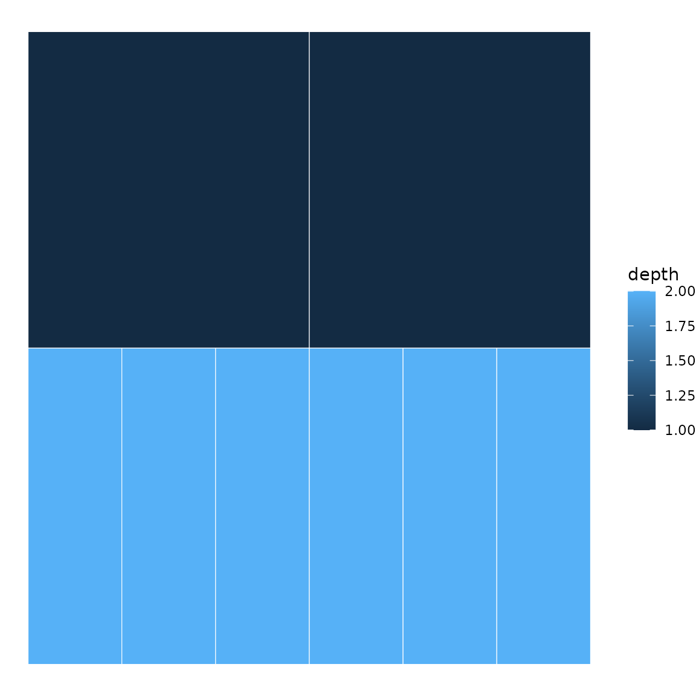
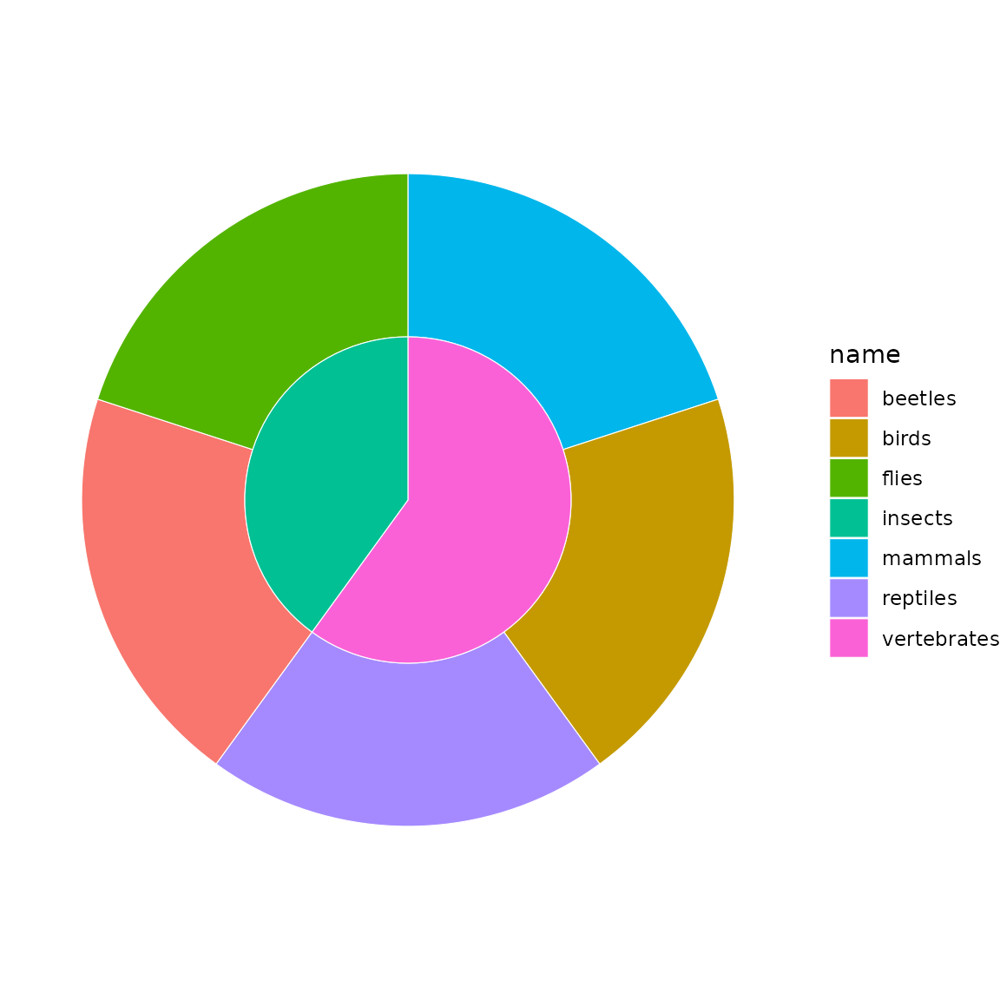
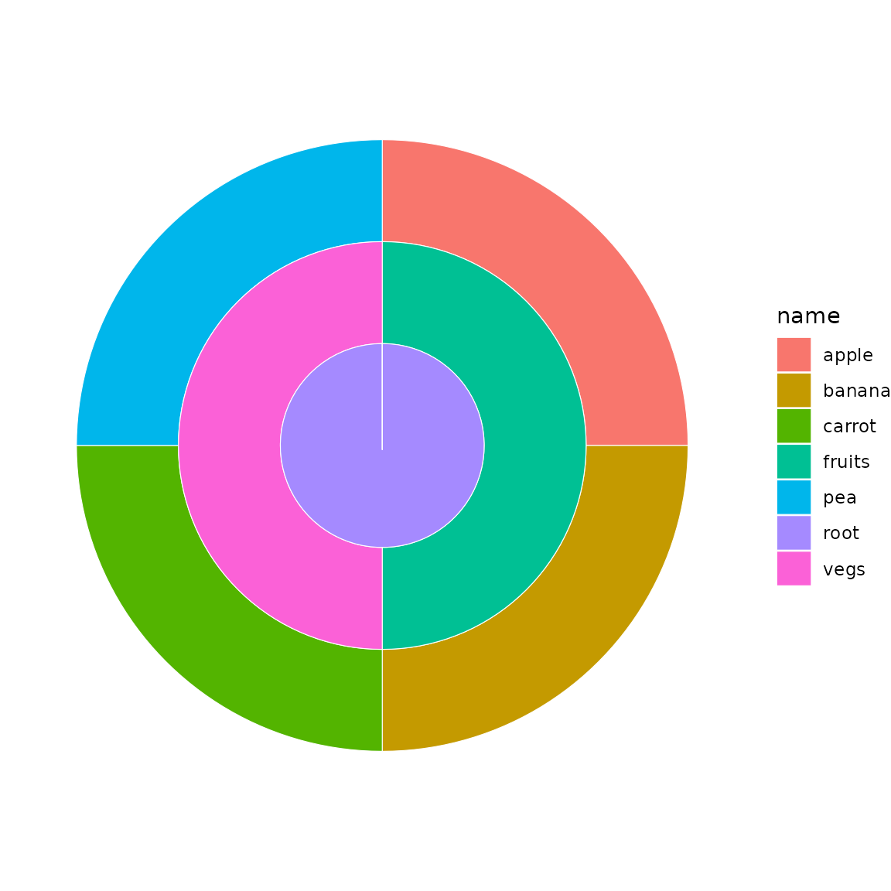
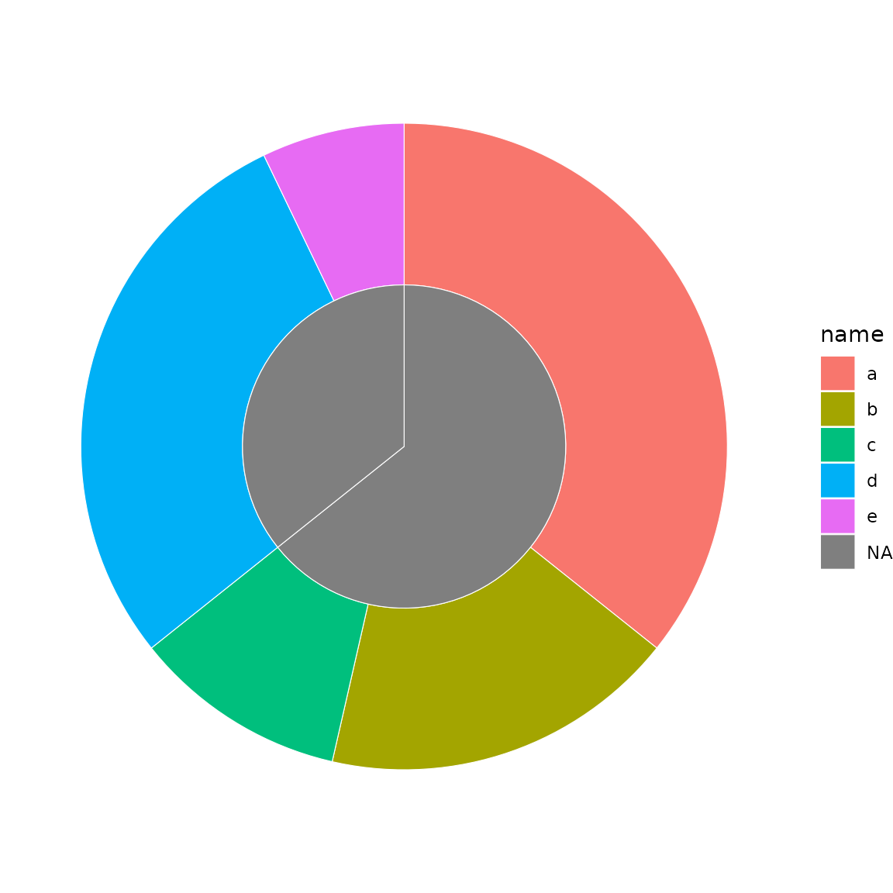
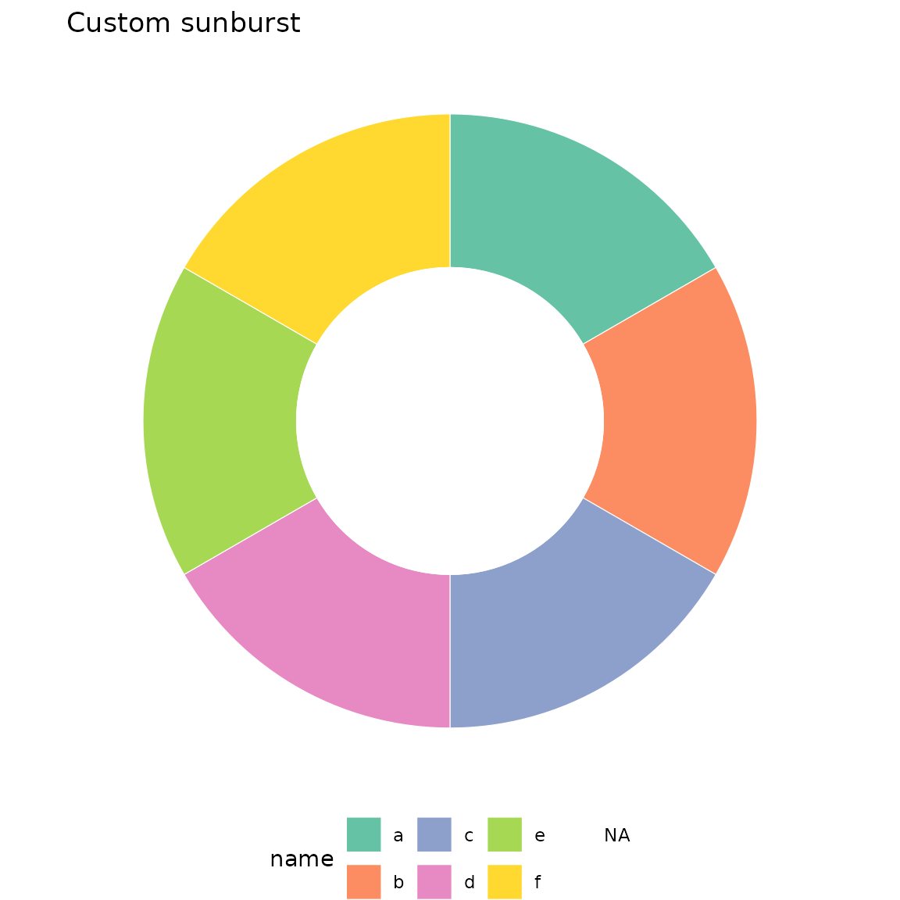
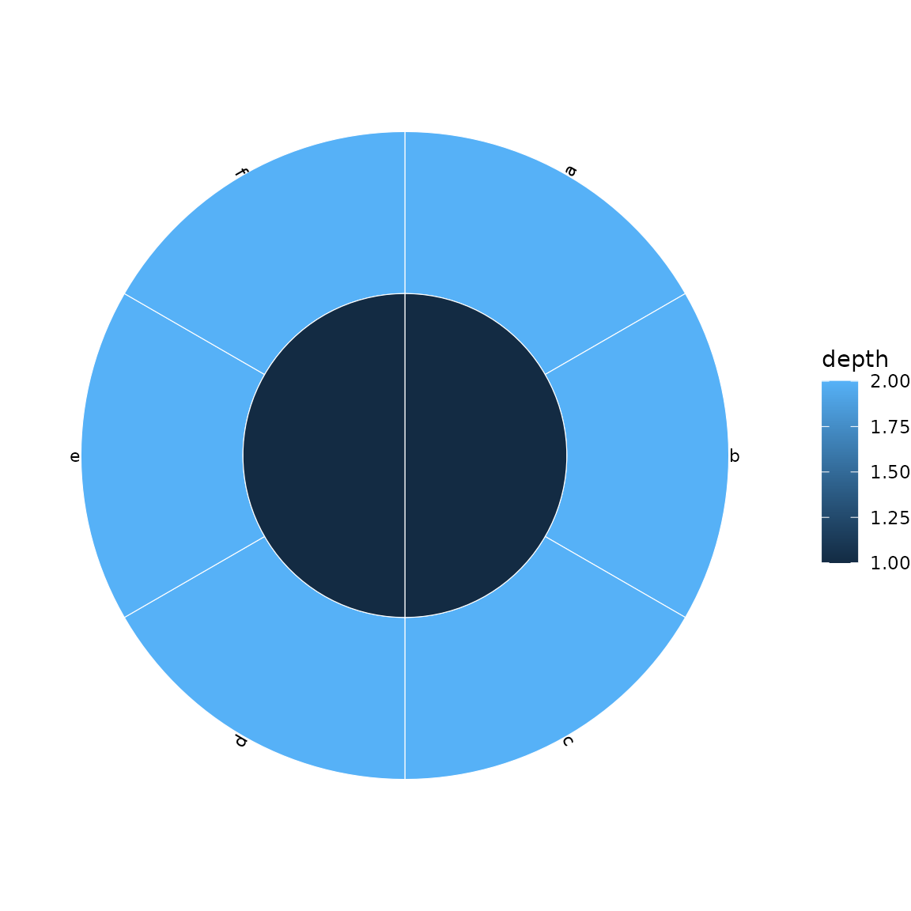
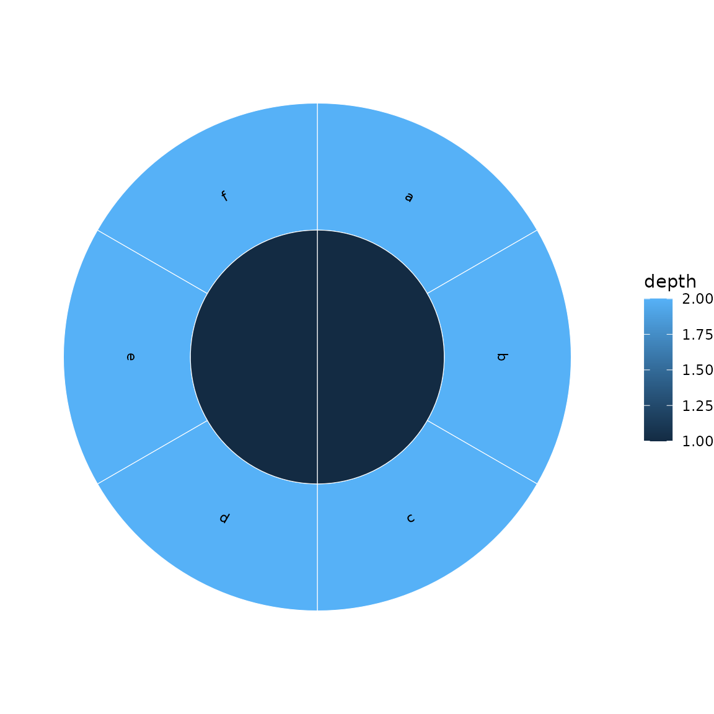
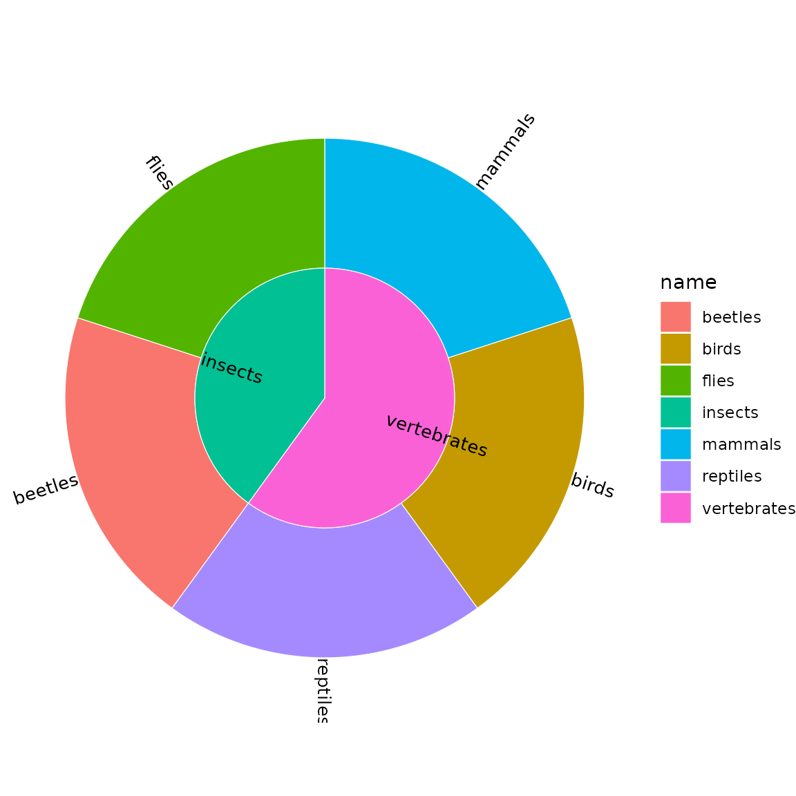
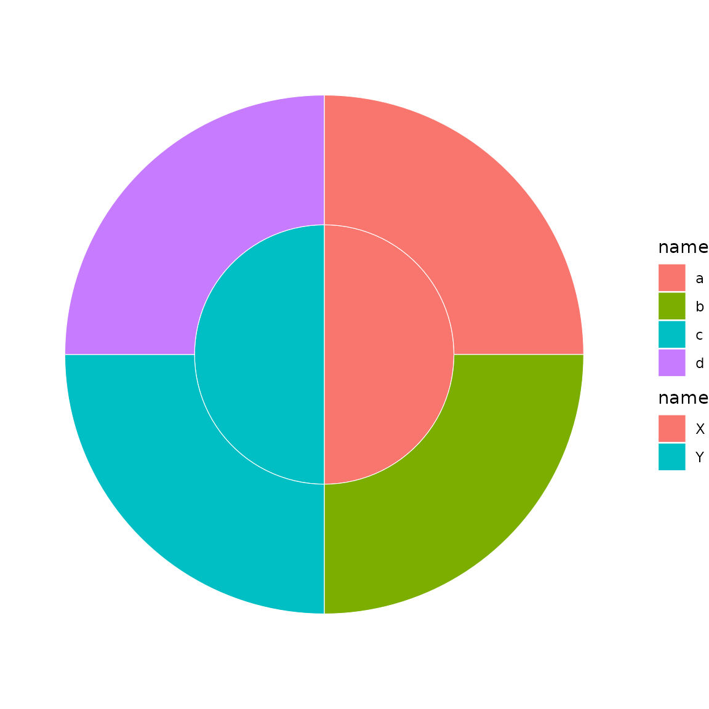

# Getting started with ggsunburstR

## Overview

ggsunburstR creates sunburst and icicle plots from hierarchical data
using ggplot2. It accepts multiple input formats and produces standard
ggplot2 objects you can customise freely.

## Basic usage

The workflow has two steps:

1.  **Prepare data** with
    [`sunburst_data()`](https://anttirask.github.io/ggsunburstR/reference/sunburst_data.md)
2.  **Plot** with
    [`sunburst()`](https://anttirask.github.io/ggsunburstR/reference/sunburst.md)
    or
    [`icicle()`](https://anttirask.github.io/ggsunburstR/reference/icicle.md)

``` r
library(ggsunburstR)

# Parse a Newick tree string
sb <- sunburst_data("((a, b, c), (d, e, f));")

# Sunburst plot
sunburst(sb, fill = "depth")
```


``` r
# Same data as an icicle plot
icicle(sb, fill = "depth")
```



## Input formats

### Newick strings

The most common input for phylogenetic or hierarchical trees:

``` r
sb <- sunburst_data("((mammals, birds, reptiles)vertebrates, (beetles, flies)insects)animals;")
sunburst(sb, fill = "name")
```



### Data frames

Use a data frame with `parent` and `child` columns:

``` r
df <- data.frame(
  parent = c(NA, "root", "root", "fruits", "fruits", "vegs", "vegs"),
  child  = c("root", "fruits", "vegs", "apple", "banana", "carrot", "pea")
)
sb <- sunburst_data(df)
sunburst(sb, fill = "name")
```



### Files

ggsunburstR can read Newick files, node-parent CSVs, and lineage TSVs
directly by passing a file path.

## Value-weighted sectors

By default, all leaves get equal angular width. Use `values` to size
sectors proportionally:

``` r
sb <- sunburst_data(
  "((a, b, c), (d, e));",
  values = c(a = 10, b = 5, c = 3, d = 8, e = 2)
)
sunburst(sb, fill = "name")
```



## Customisation with ggplot2

Since the output is a standard ggplot2 object, you can add any ggplot2
layer or theme:

``` r
sb <- sunburst_data("((a, b, c), (d, e, f));")
sunburst(sb, fill = "name") +
  ggplot2::scale_fill_brewer(palette = "Set2") +
  ggplot2::labs(title = "Custom sunburst") +
  ggplot2::theme(legend.position = "bottom")
```



## Labels

Add leaf labels with `show_labels = TRUE`:

``` r
sb <- sunburst_data("((a, b, c), (d, e, f));")
sunburst(sb, fill = "depth", show_labels = TRUE)
```



### Perpendicular labels

Use `label_type = "perpendicular"` for arc-following labels:

``` r
sunburst(sb, fill = "depth", show_labels = TRUE,
         label_type = "perpendicular")
```



### Internal node labels and filtering

Show labels for internal nodes and filter out labels on narrow sectors:

``` r
sb <- sunburst_data("((mammals, birds, reptiles)vertebrates, (beetles, flies)insects)animals;")
sunburst(sb, fill = "name", show_labels = TRUE,
         show_node_labels = TRUE, min_label_angle = 30,
         label_size = 3.5)
```



### Label repulsion (icicle)

Use `ggrepel` for collision avoidance in icicle plots:

``` r
sb <- sunburst_data("((a, b, c, d, e), (f, g, h));")
icicle(sb, fill = "depth", show_labels = TRUE, label_repel = TRUE)
```


## Per-depth fill scales

Use
[`sunburst_multifill()`](https://anttirask.github.io/ggsunburstR/reference/sunburst_multifill.md)
or
[`icicle_multifill()`](https://anttirask.github.io/ggsunburstR/reference/icicle_multifill.md)
to map different colour scales to different hierarchy levels:

``` r
sb <- sunburst_data("((a, b)X, (c, d)Y)root;")
sunburst_multifill(sb, fills = list("1" = "name", "2" = "name"))
```



## Options

Key parameters for
[`sunburst_data()`](https://anttirask.github.io/ggsunburstR/reference/sunburst_data.md):

- `values` — named numeric vector or column name for sector sizing
- `branchvalues` — `"remainder"` (default) or `"total"`
- `leaf_mode` — `"actual"` (default) or `"extended"`
- `ladderize` — sort by descendant count
- `ultrametric` — equalise leaf depths
- `xlim` — angular span (default 360)
- `rot` — rotation offset in degrees
